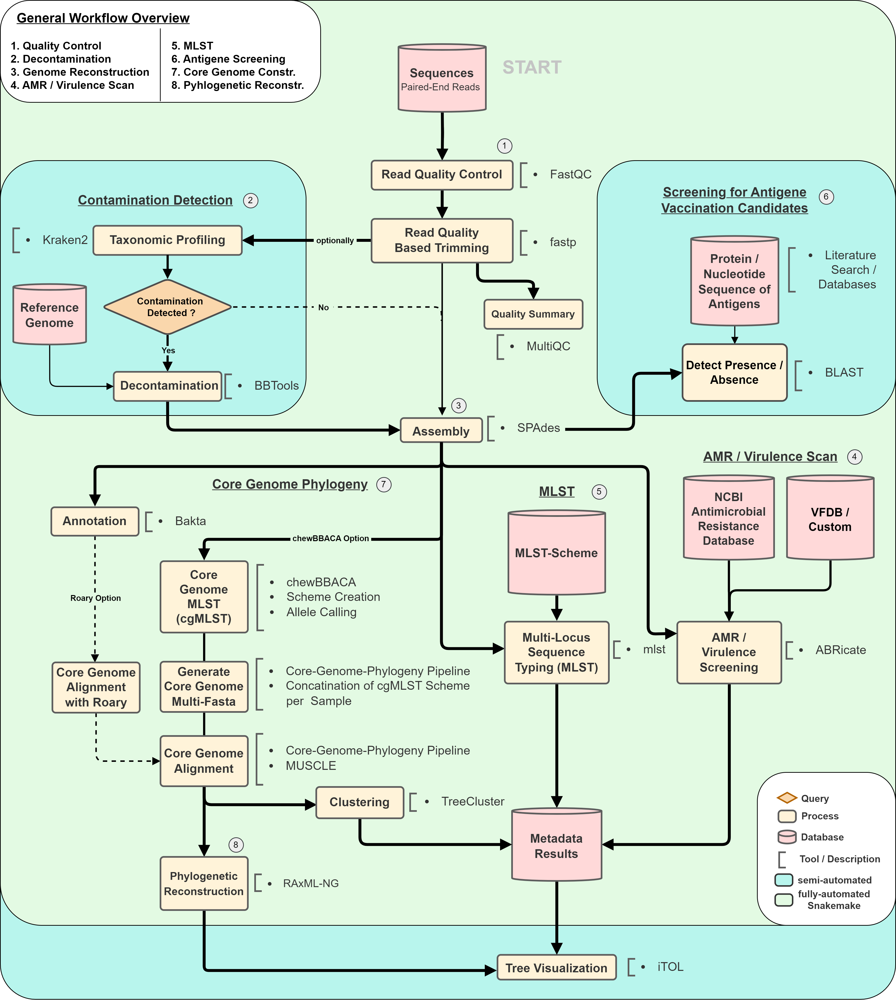

# BacPop - A Pipeline for General Population-Wide Analyses in Bacteria

This Pipeline was created to generalize and automate processes used in scope of my masters thesis. 

## Workflow Overview

This Workflow is a comprehensive and automated pipeline designed to streamline the analysis of biological sequencing data. It covers a series of essential analysis steps, from data quality control and filtering to genome assembly, annotation, and phylogenetic tree construction. By automating these steps, the workflow ensures efficient and reproducible processing of sequencing data, reducing manual intervention and saving valuable research time. It is a versatile tool suitable for a wide range of biological research projects, enabling researchers to focus on interpreting results and deriving insights from their data.

## Workflow Steps

1. **Check for Existing Results Folder**
   - If the `check_results` option is enabled in the config, the workflow checks for the existence of previous results folders.
   - If a previous run exists and the user chooses to continue, the workflow uses the existing folder. Otherwise, a new results folder is generated with a timestamp.

2. **Set Up Sample Table**
   - The workflow generates a table containing sample names, R1, and R2 file paths.

3. **Quality Control (QC)**
   - If the `qc` option is enabled, QC reports are generated using FastQC for R1 and R2 sequences.

4. **Trimming**
   - The workflow trims low-quality sequences and adapters from R1 and R2 sequences using Fastp.

5. **Assembly**
   - Assembles trimmed sequences using SPAdes to produce contigs.

6. **Annotation**
   - Genome Annotation using BAKTA is performed. The path to the Bakta Database needs to be specified in the Configuration file.

7. **MLST (Multi-Locus Sequence Typing)**
   - Performs MLST analysis on assemblies if the option `mlst` is enabled.

8. **Pan-Genome Analysis**
    - Performs pan-genome analysis using Roary to identify core and accessory genes, if the option `roary` is enabled.

9. **AMR Profiling (Antimicrobial Resistance)**
    - Profiles antimicrobial resistance genes using Abricate, if the option `amr` is enabled.

10. **cgMLST (Core Genome Multi-Locus Sequence Typing)**
    - Calculates cgMLST profiles using ChewBBACA and creates a cgMLST tree.

11. **cgMLST Alignment**
    - Aligns cgMLST profiles to create a concatenated alignment for phylogenetic analysis.

12. **Phylogenetic Tree**
    - Constructs a phylogenetic tree using RAxML based on the concatenated alignment.

This Flowchart summerizes all computational steps of BacPop. Only green highlighted steps are currently part of BacPop.

## Configuration Parameters

- **Data Path**: The path to the directory containing input data.
- **Global Parameters**: 
  - `CG`: Here, configuration regarding the method used in generating the Core Genome needs to be specified. Options are (`roary` or `chewbacca`). this needs to be set, default is `roary`. 
  - `check_results`: If set to `True`, the workflow checks for existing result folders.
  - `threads`: The number of threads to use for multi-threaded steps.
  - `memory`: The memory allocation for resource-intensive steps.
  - Various analysis steps (`qc`, `annotation`, `amr`, `virulence`, `mlst`, `kraken`) can be enabled or disabled based on your requirements.
  
- **Tool Parameters**: 
  - Configuration parameters for individual tools such as annotation, cgMLST, AMR, and the phylogenetic tree model.

## Usage
1. Place your input data in the specified data path.
2. Modify the config file to customize parameters for your analysis.
3. Execute the Snakemake workflow using this example command: `snakemake -s Snakefile --use-conda --cores 4 --conda-frontend mamba `.

## Benefits
- Streamlines complex bioinformatics analysis.
- Facilitates reproducibility and collaboration.
- Customizable to specific research needs.
- Automates tedious tasks, saving time and effort.

## Disclaimer and Licensing

This pipeline is provided under the MIT License, allowing users to freely utilize and modify it as needed. However, it's important to note that the accuracy of results may vary and there are no guarantees for any generated results using BacPop.
